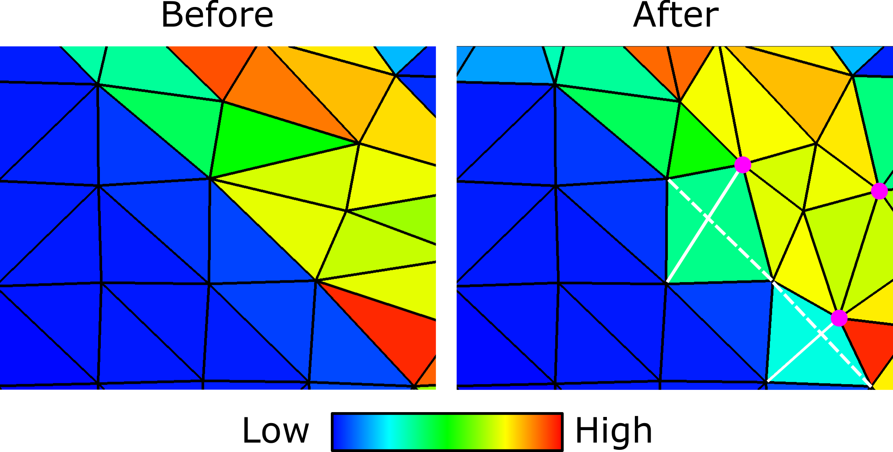

# Remeshing

We assess the mesh quality at fixed temporal intervals and use specific
quality measures to decide whether to keep using the present mesh or
remesh. For example, if the smallest angle of an element is less than a
certain prescribed value, we remesh. 

## New mesh creation

The default mode of remeshing is to create a new mesh preserving the old mesh's boundaries.
The meshing libraries linked during the build are resued: `triangle` for 2D and `tetgen` for 3D.
To assist the meshing process, DES provides a point set for the meshing libraries to start with.
However, a group of nodes in the deformed mesh may be removed from the point set if any of the following criteria is met:

- Left outside of the new boundaries when a deformed or displaced boundary is restored to the
initial configuration
- Surrounded only by small elements 

Once all criteria are enforced, a final list of nodes is collected and used for constructing a new
mesh. During the process, new nodes might be inserted into the mesh or the mesh topology changed 
through edge-flipping (see the figure below) during the triangulation.

<em>(above) Plastic strain distribution on a mesh before and after remeshing. Solid and dashed white lines are new and old element edges. 
Pink circles are newly added nodes.</em>

## Mesh optimization

As described in https://geoflac.github.io/des3d/docs/tutorial/usingmmg, a user can choose link 
[MMG](https://mmgtools.org) when building DES. MMG performs mesh optimization allowing a metric-based 
element size variation and the metric itself can be defined in terms of one of the physical variables 
like accumulated plastic strain.

## Variable mapping from old to new mesh

After the new mesh is created, the boundary
conditions, derivatives of shape function, and mass matrix have to be
re-calculated. 

Also, an inter-mesh mapping of variables is performed. 
For data associated to nodes (e.g., velocity and
temperature), we use linear interpolation of the data from the old mesh
to evaluate the field at the new nodal location. For data associated to
elements (e.g., strain and stress), we use a nearest-neighbor mapping.

<!-- When most of the deformation is focused in and around a few deformation
zones like shear bands, most of the elements outside of the zones deform
only slightly and thus mostly remain unaffected by remeshing. The high
degree of similarity between the new and old meshes makes projecting the
fields of variables between the meshes very easy. For nodes and elements
unaffected by remeshing, which are the majority, a simple injection
suffices. That is, the data of the nodes and elements of the old mesh
are mapped onto the nodes and elements which are collocated with them in
the new mesh. -->

<!-- When deformation is not localized but distributed over a broad region of
the domain, remeshing might result in a new mesh that is very different
from the old one. Then, an inter-mesh mapping of variables becomes
necessary. -->

